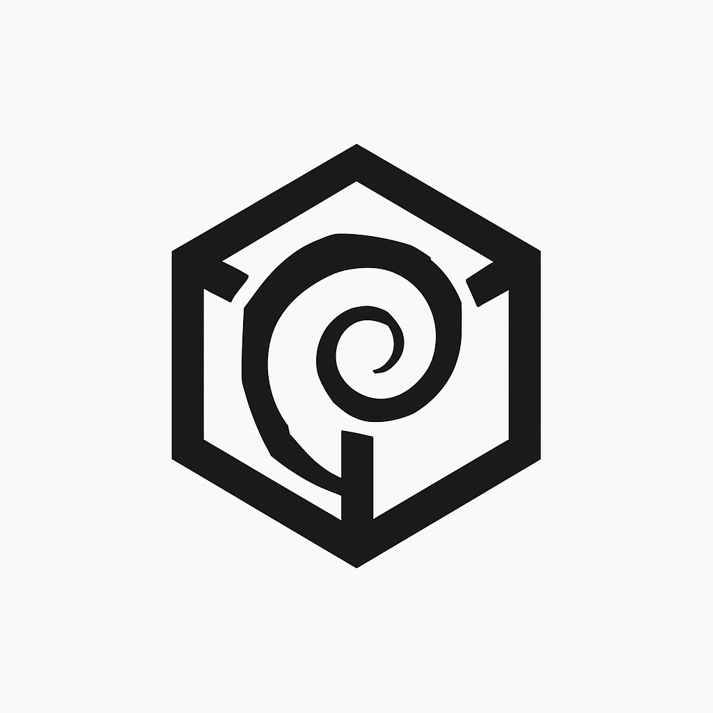
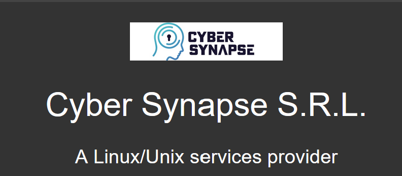

<p align="center">
  <br><br>
</p>

<p align="center">
  <br><br>
  <br><br>
  <code>HARDN-Endpoint</code>
</p>


<p align="center">
  <br><br>
</p>


### HARDN Endpoint for Ubuntu
- This installation is specifically designed for **U B U N T U - P R O - 2 4 . 0 4**
- Currently under testing and evaluation and is not at a PRODUCTION state.
- HARDN is a robust and secure endpoint management solution designed to simplify and enhance the management of devices in your network. It provides advanced features for monitoring, securing, and maintaining endpoints efficiently.
- With this release, we bring `STIG` COMPLIANCE to align with the Security Technical Information Guides provided by the DOD Cyber Exchange.

<p align="center">
  <br><br>
</p>

- **Comprehensive Monitoring**: Real-time insights into endpoint performance and activity.
- **Enhanced Security**: Protect endpoints with advanced security protocols.
- **Scalability**: Manage endpoints across small to large-scale networks.
- **User-Friendly Interface**: Intuitive design for seamless navigation and management.
- **STIG Compliance**: This release brings the utmost security for Ubuntu-based government information systems. 

### File Structure


```bash
HARDN/
├── .gitignore
├── README.md
├── changelog.md
├── docs/
│   ├── HARDN.md
│   ├── LICENSE
│   ├── ubnt_fips.md
│   ├── ubnt_stig.md
│   └── assets/
│       ├── HARDN(1).png
│       └── cybersynapse.png
├── src/
│   └── setup/
│       ├── ubuntu-setup.sh
│       ├── ubuntu-fips.sh
│       └── ubuntu-packages.sh
```

</p>


<p align="center">
  <br><br>
</p>

The purpose of HARDN Endpoint is to empower IT administrators and users with the tools they need to ensure endpoint security, optimize performance, and maintain compliance across their organization.

<p align="center">
  <br><br>
</p>


1. Clone the repository from GitHub:
  ```bash
  git clone https://github.com/opensource-for-freedom/HARDN.git
  ```
2. Navigate to the `src` directory:
 ```bash
  cd HARDN/src/ubuntu-setup
  sudo chmod +x ubuntu-setup.sh
  sudo ./ubuntu-setup.sh

  ```

3. Executing `ubuntu-fips.sh`:

Navigate to the `src` directory:

 ```bash
  cd HARDN/src/setup
  sudo chmod +x ubuntu-fips.sh
  sudo ./ubuntu-fips.sh
  ```

  This will kick off the full setup of HARDN with `FIPS-140` principles. 

  **THIS DOES MAKE SIGNIFICANT KERNEL MODIFICATIONS** Execute with caution. You will need an **Ubuntu-Pro License** to fully interact with the FIPS components. 
  ### NOTE: 

  
  #### AIDE will take 20-60 minutes to fully establish the "ADVANCED INTRUSION DETECTION SYSTEM"; however, this runs in the background. 
  - This script will run synchronously and reboot your system when complete. 
  - DO NOT turn your system off: We have established an update routine with reboots using CRON. 
  - HARDN, once executed, will keep your Ubuntu system secure and up to date. 

6. Follow any additional setup instructions and information provided in the `docs` directory.
</p>

<p align="center">
  <br><br>
We welcome contributions! 


</p>

<p align="center">
  <br><br>
</p>


<p align="center">
  
</p>


<p align="center">
  <br><br>
This project is licensed under the GPLicense
  
</p>


<p align="center">
  <br><br>
office@cybersynapse.ro
</p>


