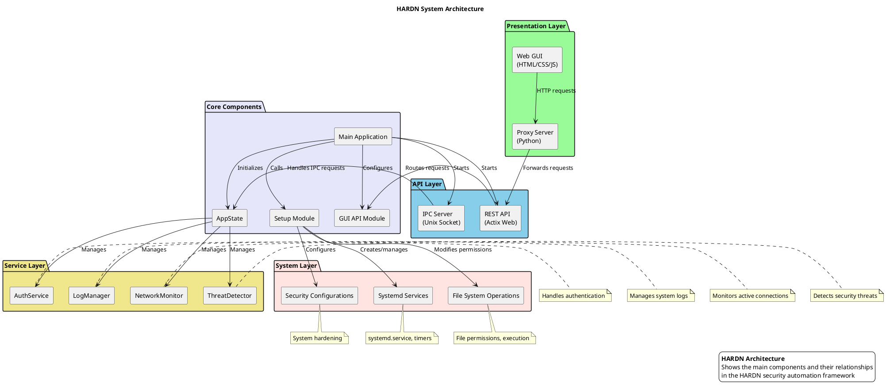

```plantuml
@startuml
' Title
title HARDN System Architecture

' Style settings
skinparam componentStyle rectangle
skinparam backgroundColor white
skinparam shadowing false

' Packages with standard colors
package "Presentation Layer" as PL #palegreen {
  [Web GUI\n(HTML/CSS/JS)] as GUI
  [Proxy Server\n(Python)] as Proxy
}

package "API Layer" as AL #skyblue {
  [REST API\n(Actix Web)] as REST
  [IPC Server\n(Unix Socket)] as IPC
}

package "Service Layer" as SL #khaki {
  [NetworkMonitor] as Network
  [ThreatDetector] as Threat
  [AuthService] as Auth
  [LogManager] as Log
}

package "System Layer" as SYL #mistyrose {
  [Systemd Services] as Systemd
  [File System Operations] as FS
  [Security Configurations] as Security
}

package "Core Components" as CC #lavender {
  [AppState] as State
  [Main Application] as Main
  [Setup Module] as Setup
  [GUI API Module] as GUIAPI
}

' Relationships
GUI --> Proxy : HTTP requests
Proxy --> REST : Forwards requests
REST --> GUIAPI : Routes requests
IPC --> State : Handles IPC requests

State --> Network : Manages
State --> Threat : Manages
State --> Auth : Manages
State --> Log : Manages

Main --> State : Initializes
Main --> Setup : Calls
Main --> IPC : Starts
Main --> REST : Starts
Main --> GUIAPI : Configures

Setup --> Systemd : Creates/manages
Setup --> FS : Modifies permissions
Setup --> Security : Configures

' Notes
note right of Network : Monitors active connections
note right of Threat : Detects security threats
note right of Auth : Handles authentication
note right of Log : Manages system logs

note bottom of Systemd : systemd.service, timers
note bottom of FS : File permissions, execution
note bottom of Security : System hardening

' Legend
legend right
  **HARDN Architecture**
  Shows the main components and their relationships
  in the HARDN security automation framework
endlegend

@enduml
```