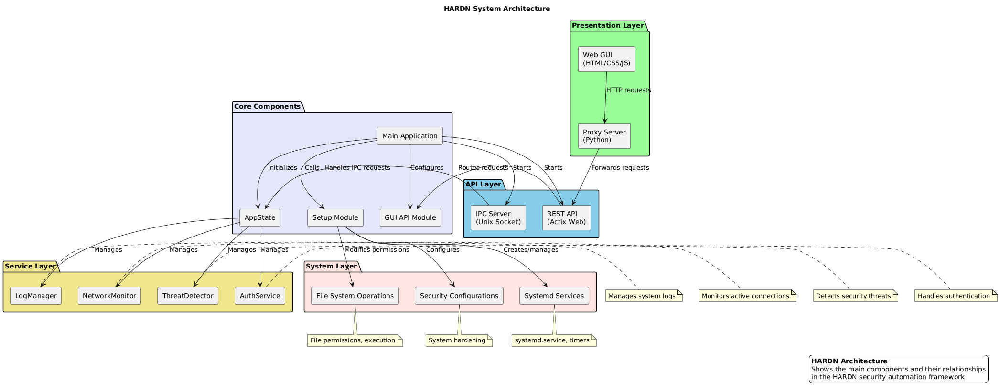

# HARDN System Architecture

1. **Core Components**:
    - **Main Application** - The central controller that initializes and orchestrates all components
    - **Setup Module** - Handles system initialization and configuration
    - **GUI API** - Provides interface between backend and frontend

2. **Service Modules**:
    - **NetworkMonitor** - Monitors network connections
    - **ThreatDetector** - Detects and reports security threats
    - **AuthService** - Handles authentication and token management
    - **LogManager** - Manages system logs

3. **Communication Channels**:
    - **IPC Server** - Unix socket-based inter-process communication
    - **REST API** - HTTP-based API for GUI integration
    - **System Integration** - Systemd services and timers

4. **Design Patterns Used**:
    - **Singleton Pattern** - For AppState management
    - **Observer Pattern** - For system monitoring
    - **Factory Pattern** - For creating service instances
    - **Facade Pattern** - GUI API providing simplified interface

5. **Data Flow**:
    - Request handling from GUI to backend services
    - Event notifications from monitoring services
    - Authentication flow

 

1. **Presentation Layer** (Top):
    - Web GUI (HTML/CSS/JS)
    - Proxy Server

2. **API Layer**:
    - REST API
    - IPC Server

3. **Service Layer**:
    - NetworkMonitor
    - ThreatDetector
    - AuthService
    - LogManager

4. **System Layer** (Bottom):
    - Systemd Services
    - File System Operations
    - Security Configurations

 

**HARDN System Architecture Illustrated:**
- Boxes representing components/classes
- Arrows showing dependencies and data flow
- Different colors for different types of components
- Clear labels for all elements

